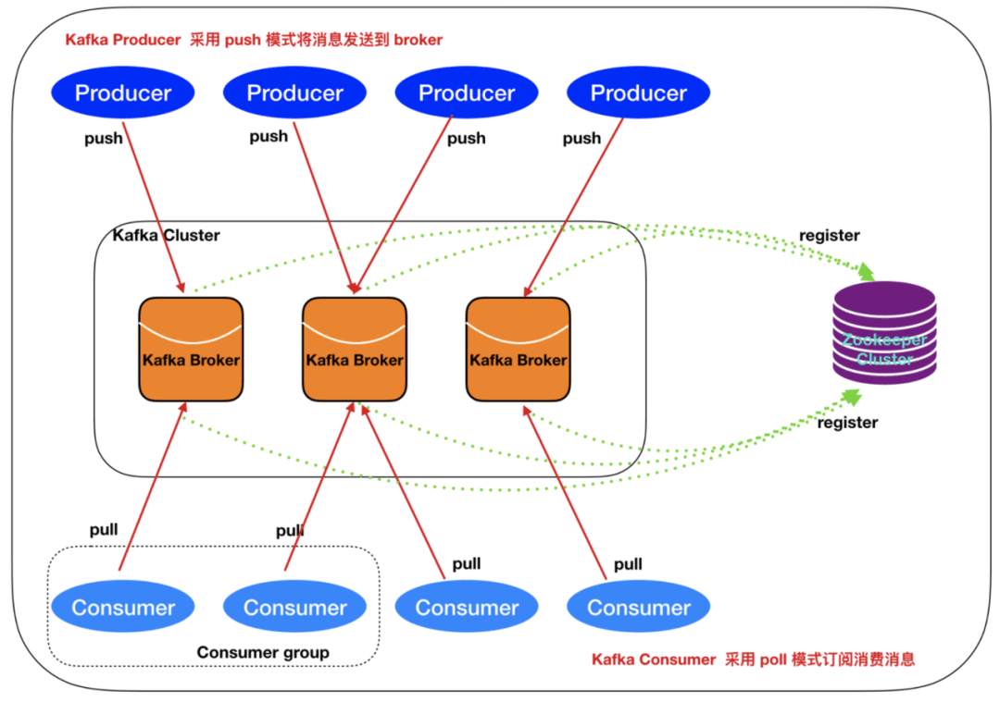
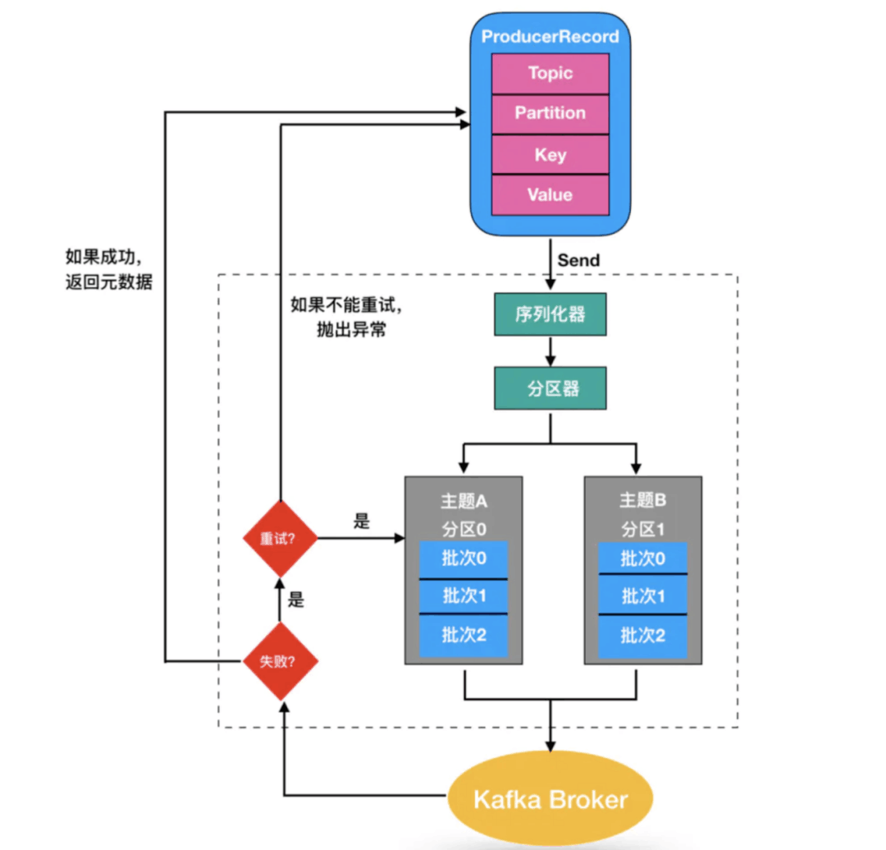
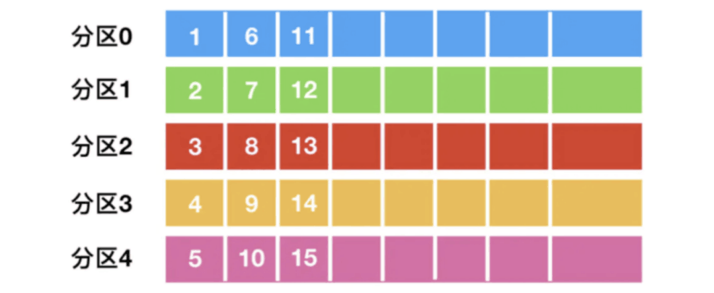

# 介绍
Kafka为Apache下的一个开源项目，官方定义为分布式流处理平台，它可做的事情不止于MQ。
- 消息系统
- 存储系统
- 流处理

Apache Kafka 最初由 LinkedIn 公司基于独特的设计实现为一个分布式的提交日志系统，之后成为 Apache 项目的一部分，号称大数据的杀手锏，在数据采集、传输、存储的过程中发挥着举足轻重的作用。
它是一个分布式的，支持多分区、多副本，基于 Zookeeper 的分布式消息流平台，它同时也是一款开源的基于发布订阅模式的消息引擎系统。
重要概念
• 主题（Topic）：消息的种类称为主题，可以说一个主题代表了一类消息，相当于是对消息进行分类，主题就像是数据库中的表。
• 分区（partition）：主题可以被分为若干个分区，同一个主题中的分区可以不在一个机器上，有可能会部署在多个机器上，由此来实现 kafka 的伸缩性。
• 批次：为了提高效率， 消息会分批次写入 Kafka，批次就代指的是一组消息。
• 消费者群组（Consumer Group）：消费者群组指的就是由一个或多个消费者组成的群体。
• Broker: 一个独立的 Kafka 服务器就被称为 broker，broker 接收来自生产者的消息，为消息设置偏移量，并提交消息到磁盘保存。
• Broker 集群：broker 集群由一个或多个 broker 组成。
• 重平衡（Rebalance）：消费者组内某个消费者实例挂掉后，其他消费者实例自动重新分配订阅主题分区的过程。

Kafka 架构
一个典型的 Kafka 集群中包含 Producer、broker、Consumer Group、Zookeeper 集群。
Kafka 通过 Zookeeper 管理集群配置，选举 leader，以及在 Consumer Group 发生变化时进行 rebalance。Producer 使用 push 模式将消息发布到 broker，Consumer 使用 pull 模式从 broker 订阅并消费消息。

Kafka 工作原理
消息经过序列化后，通过不同的分区策略，找到对应的分区。
相同主题和分区的消息，会被存放在同一个批次里，然后由一个独立的线程负责把它们发到 Kafka Broker 上。

分区的策略包括顺序轮询、随机轮询和 key hash 这 3 种方式，那什么是分区呢？
分区是 Kafka 读写数据的最小粒度，比如主题 A 有 15 条消息，有 5 个分区，如果采用顺序轮询的方式，15 条消息会顺序分配给这 5 个分区，后续消费的时候，也是按照分区粒度消费。

由于分区可以部署在多个不同的机器上，所以可以通过分区实现 Kafka 的伸缩性，比如主题 A 的 5 个分区，分别部署在 5 台机器上，如果下线一台，分区就变为 4。
Kafka 消费是通过消费群组完成，同一个消费者群组，一个消费者可以消费多个分区，但是一个分区，只能被一个消费者消费。

如果消费者增加，会触发 Rebalance，也就是分区和消费者需要重新配对。
不同的消费群组互不干涉，比如下图的 2 个消费群组，可以分别消费这 4 个分区的消息，互不影响。

优点：
• 高吞吐、低延迟：Kafka 最大的特点就是收发消息非常快，Kafka 每秒可以处理几十万条消息，它的最低延迟只有几毫秒；
• 高伸缩性：每个主题（topic）包含多个分区（partition），主题中的分区可以分布在不同的主机（broker）中；
• 高稳定性：Kafka 是分布式的，一个数据多个副本，某个节点宕机，Kafka 集群能够正常工作；
• 持久性、可靠性、可回溯：Kafka 能够允许数据的持久化存储，消息被持久化到磁盘，并支持数据备份防止数据丢失，支持消息回溯；
• 消息有序：通过控制能够保证所有消息被消费且仅被消费一次；
• 有优秀的第三方 Kafka Web 管理界面 Kafka-Manager，在日志领域比较成熟，被多家公司和多个开源项目使用。
缺点：
• Kafka 单机超过 64 个队列/分区，Load 会发生明显的飙高现象，队列越多，load 越高，发送消息响应时间变长；
• 不支持消息路由，不支持延迟发送，不支持消息重试；
• 社区更新较慢。