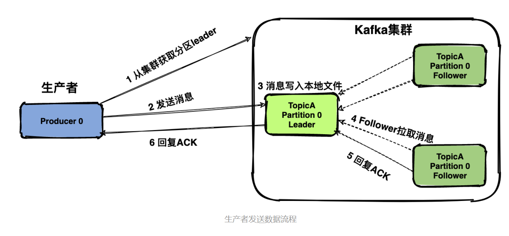
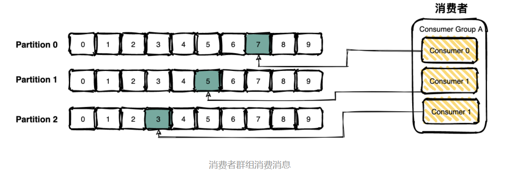

# 消息丢失
首先说明一个概念：message delivery semantic 也就是消息传递语义，简单说就是消息传递过程中消息传递的保证性。主要分为三种：
* at most once：最多一次。消息可能丢失也可能被处理，但最多只会被处理一次。
* at least once：至少一次。消息不会丢失，但可能被处理多次。可能重复，不会丢失。
* exactly once：精确传递一次。消息被处理且只会被处理一次。不丢失不重复就一次。

理想情况下肯定是希望系统的消息传递是严格exactly once，也就是保证不丢失、只会被处理一次，但是很难做到。

Kafka有三次消息传递的过程：
1. 消息产生。生产者发消息给Kafka Broker
2. 消息保存。Kafka Broker 消息同步和持久化
3. 消息消费。Kafka Broker 将消息传递给消费者并进行消费 

在这三步中每一步都有可能会丢失消息。

## 一、消息产生过程消息丢失
### 消息确认机制
为了避免消息产生过程消息丢失，在Kafka Broker收到消息后可进行一个ACK确认。

Kafka通过配置 `request.required.acks` 属性来确认消息的生产：
* 0表示不进行消息接收是否成功的确认。不能保证消息是否发送成功，生成环境基本不会用，可能丢失消息。
* 1表示当Leader接收成功时确认。如果这时Leader挂了，一个未同步到这条消息的Follower被选举为Leader，可能丢失消息。
* -1或者all表示Leader和Follower都接收成功时确认。可以最大限度保证消息不丢失，但是吞吐量低。
> 难道不加一个半数Leader/Follower成功就ACK吗？

### 网络原因
消息产生过程中由于网络原因失败了，但不确定是上图的步骤2还是步骤6，因此这时Producer并不知道成功与否，如果不重新发送消息，则可能消息丢失；如果重新发送，则可能生成重复消息。

这种情况是无解的，只能接受可能的消息丢失（at most once）或重复消息（at least once）。

## 二、消息保存过程消息丢失
Kafka Broker 接收到数据后会将数据进行持久化存储（不是马上进行的）。如果未来得及持久化存储时Kafka Broker也会丢失消息。比较极端。

## 三 、消息消费过程消息丢失
消费者通过pull模式主动的去 kafka 集群拉取消息，与producer相同的是，消费者在拉取消息的时候也是找leader分区去拉取。

消费者消费的进度通过offset保存在kafka集群的__consumer_offsets这个topic中。

消费消息的时候主要分为两个操作：
- 标识消息已被消费，commit offset坐标
- 业务方处理消息

这两个操作无法做到原子性，所以也是会导致消息丢失或者重复消费的。

场景一：先commit再处理消息。如果在处理消息的时候异常了，但是offset 已经提交了，造成消息丢失。

场景二：先处理消息再commit。如果在commit之前发生异常，下次还会消费到该消息，造成重复消费。

> 这里不增加一个ACK机制吗？  
> 如果某条消息本身异常，一直消费失败，按场景二，是会一直卡在那儿吗？

## 总结
在生产环境中严格做到exactly once其实是难的，同时也会牺牲效率和吞吐量，最佳实践是业务侧做好补偿机制，万一出现消息丢失可以兜底。
如果业务侧能做到消息的消费幂等，是可以接受消息重复的（at least once）。